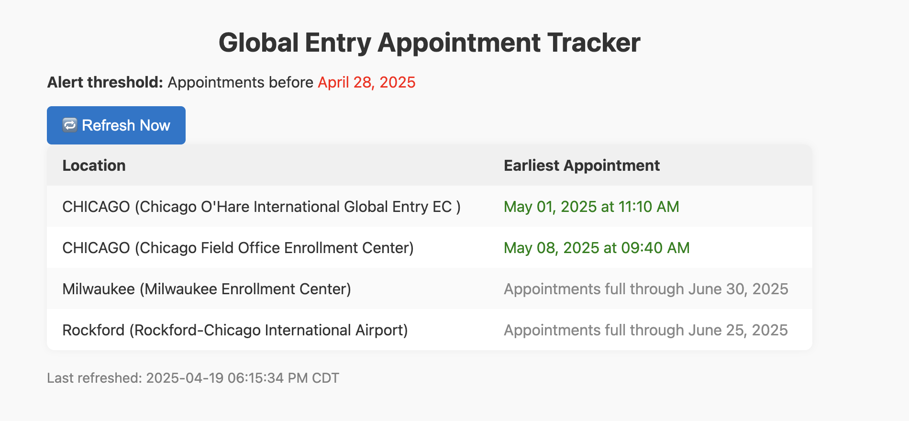

# global-entry-appt-checker

This is python application that helps track and notify the user if an early appointment has been found at their selected locations.

### Important Commands Running Locally
`python3 -m venv venv` : installs ability to create and get into a virtual local environment

`source venv/bin/activate` : gets you into the virtual env

`deactivate` : gets you out of the virtual env

`pip install -r requirements.txt` : install required python libraries for this project

`python3 app.py` : runs the application

### Creating a .env file locally
Make sure you create a .env within this repository's directory in order for this application to work for you
The following should be filled in:

`EMAIL_ADDRESS=your_email@gmail.com`

`EMAIL_PASSWORD=your_gmail_app_password`

`TO_EMAIL=your_email@gmail.com   # Or any other email address you want alerts sent to`

`ALERTS_ENABLED=false #if you would like email notification about earlier appointments found compared to threshold date`

For help getting your app password if you are using G-mail, I suggest following this video: [How To Set Up Gmail SMTP Server - Full Guide
](https://www.youtube.com/watch?v=ZfEK3WP73eY).

#### Testing Email Sending Locally
Once you set up your .env file, run the following command: `python3 test_send_email.py`

### Deployment
Start command for application: `python3 app.py`

Make sure to include the .env variables as detailed above in this readme

